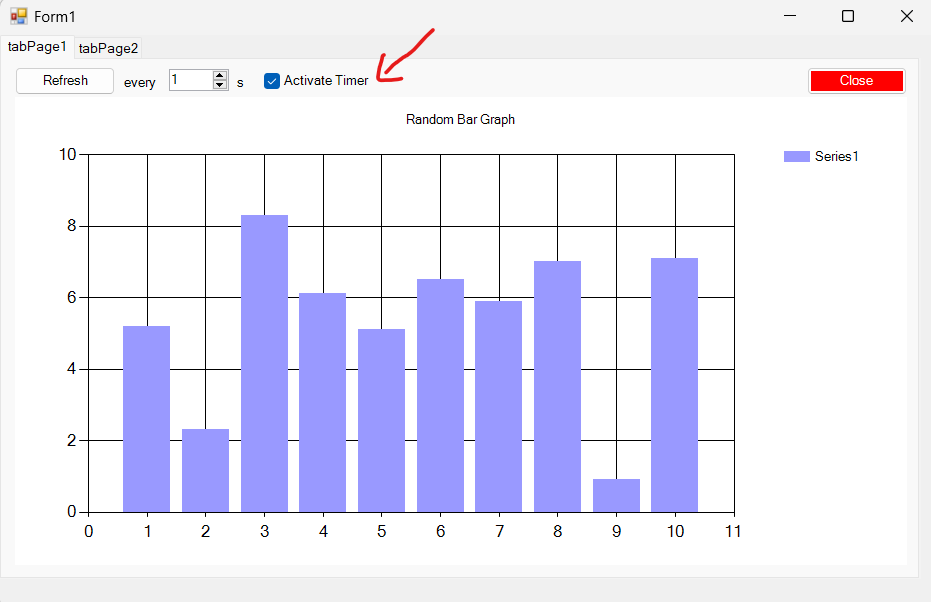

# MQL5_CSharp
MQL5 Integration with C#

## Instructions 

Copy file \GuiMT\bin\GuiMT.dll to MetaEditor Library folder  
Copy file CSharp.mq5 to MetaEditor Script Folder and Compile it, or copy CSharp.ex5 directly into Scripts folder.  

Open MT5 and run the script.  

[Check the Medium Article!](https://camilochaves.medium.com/simplest-connection-between-mql5-and-net-c-552c229aa12f)

## What´s Changed

1. Added a timer to automatically refresh data every 1s

2. Added a new .NET6 project for cross-platform apps. 
   a) (still a work in progress! Code compiles but Form does not show in MQL5 - need to investigate why!)
   
